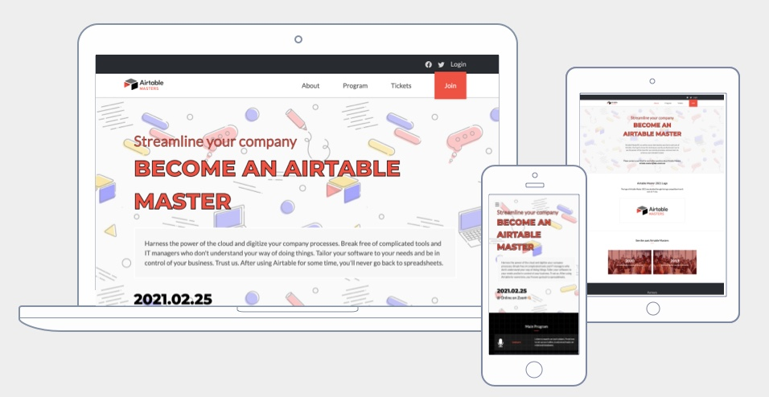

# HTML & CSS Project: Conference website

> Fourth week of the Microverse program. First capstone project 💪🏼
> Done entirely from scratch, using mostly vanlissa CSS with a little help from Sass

In this project we created a conference website from scratch, using the design of [Cindy Shin](https://www.behance.net/adagio07) as a starting point. We took some creative freedom on the topic and styling, but mostly respected the client's brief (which is Cindy's original design).

## Built With

- HTML5 & CSS3

## Live Demo

[Live Demo Link](https://ey-charles.github.io/mv-04-capstone/)

## Author

👤 **Carlos Castillo**

- GitHub: [@ey-charles](https://github.com/ey-charles)
- Twitter: [@crloscstillo](https://twitter.com/crloscstillo)
- LinkedIn: [Carlos Castillo](https://www.linkedin.com/in/carlos-castillo-70430711a/)

## Show your support

Give a ⭐️ if you like this project!

## Acknowledgments

- Shoutout to our Stand-Up Teams

## 📝 License

This project is [MIT](https://www.mit.edu/~amini/LICENSE.md) licensed.
